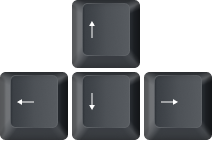
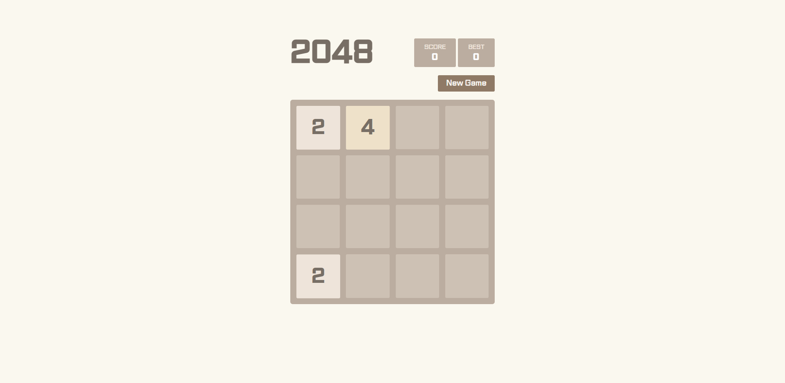
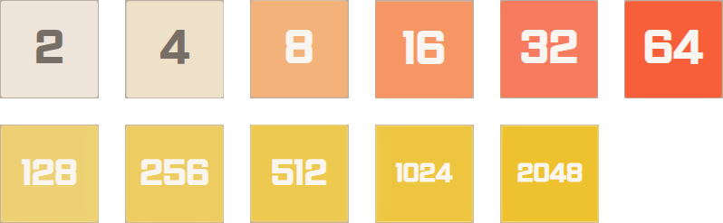
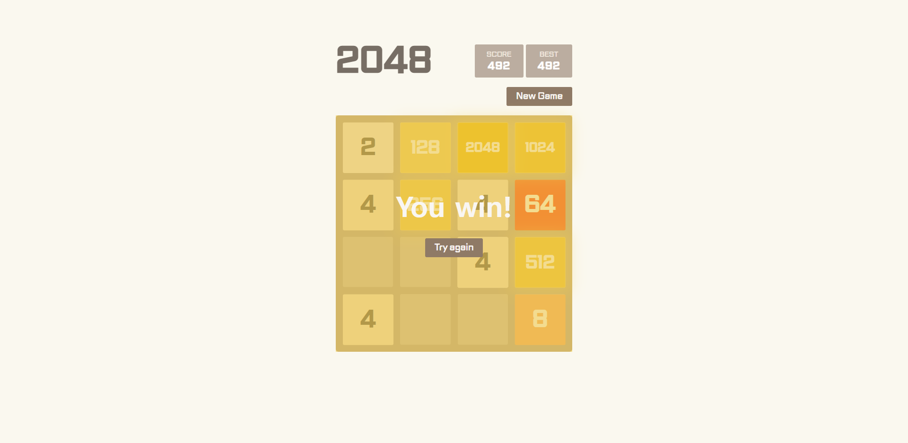
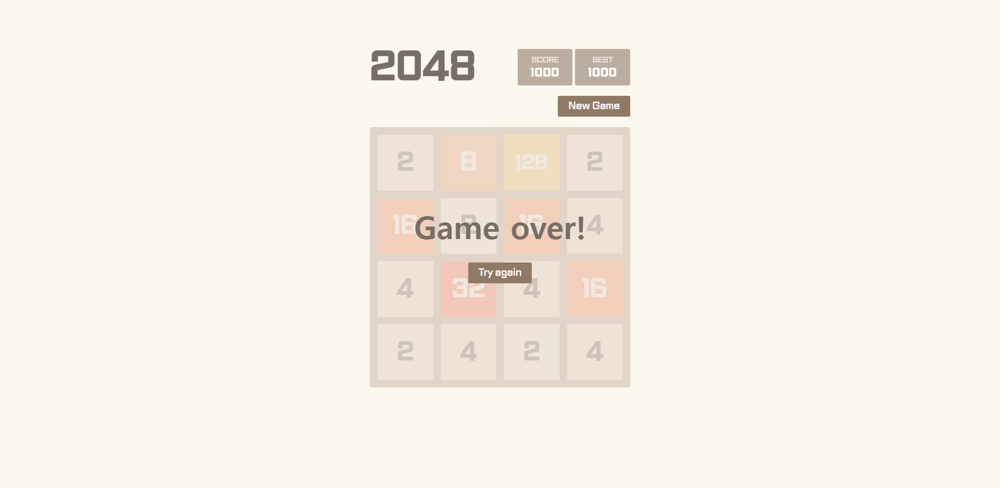
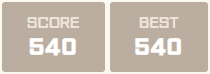
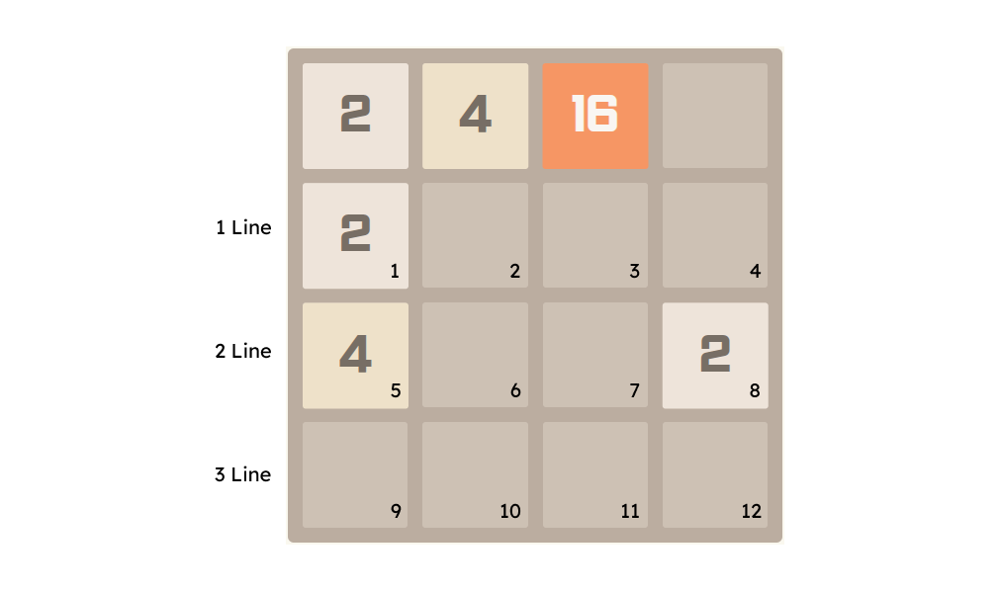

# <center>게임 방법</center>
<br/>
<center></center>

### 키보드의 ↑ → ↓ ← 키를 활용하여 타일을 움직이고 합치면 됩니다.
<br/>

<center></center>

### 새로운 타일은 2, 4 중에 랜덤으로 생성되며 같은 숫자의 타일만 합칠 수 있습니다.
<br/>

<center></center>
<br/>
<center></center>

### 2 → 4 → 8 → 16 → 32 → 64 → 128 → 256 → 512 → 1024 → 2048순으로 최종적으로는 2048을 만들면 게임에서 승리합니다.
<br/>

<center></center>

### 2048을 만들기 전에 더 이상 새로운 타일을 생성할 수 없다면 게임에서 패배합니다.
<br/>

<center></center>

### SCORE에는 현재 나의 점수를 BEST에서는 나의 최고 점수를 확인할 수 있습니다.
<br/>
<br/>

# <center>기능 구현</center>
<br/>


```html
<div class="tile tile-8 tile-position-3-1 tile-new">
  <div class="tile-inner">8</div>
</div>
```

```js
// 상태관리 배열
function stateManagement() {
  const $tile = document.querySelectorAll('.tile');
  let stateArray = [[0, 0, 0, 0],[0, 0, 0, 0],[0, 0, 0, 0],[0, 0, 0, 0]];

  $tile.forEach((elm) => {
    let elmNumber = elm.textContent;
    let posNumberOne = elm.classList[2][14] - 1;
    let posNumberTwo = elm.classList[2][16] - 1;
    stateArray[posNumberOne].splice(posNumberTwo, 1, parseInt(elmNumber));
  });
  return stateArray;
}
```

### 타일의 위치는 .tile.tile-position-?-?로 결정되고 타일의 숫자는 .tile.tile-?로 결정 됩니다. 우선적으로 타일의 랜덤한 위치를 생성하기 위해서는 html태그의 위치를 js에서 실시간으로 확인할 수 있어야 했으므로 stateManagement 함수를 만들어 4x4배열을 만들었습니다. 그리고 .tile이 있을 경우 .tile.tile-position-?-?의 ?부분으로 추출하여 posNumberOne, posNumberTwo변수에 저장하고 이를 활용하여 4x4배열의 아이템을 수정할 수 있게 만들었습니다.
<br/>

```js
// 타일 위치 생성
function createPositionNumber() {
  let stateArray = stateManagement();
  let emptyTilePos = [];
  stateArray.forEach((elm, i) => {
    stateArray.forEach((elm, j) => {
      if(stateArray[i][j] !== 0) return;
      emptyTilePos.push([i, j]);
    });
  });
  return emptyTilePos;
}
```

### 비어있는 타일의 위치를 알아내기 위해서 createPositionNumber 함수를 만들었습니다. stateManagement함수의 배열을 순회하여 아이템의 값이 0이 아닐 경우에만 빈 배열 emptyTilePos에 stateManagement함수 배열에 값이 0인 아이템의 값을 i,j로 push했습니다.
<br/>

```js
// 타일 숫자 생성
function createTileNumber() {
  let tileValueArray = Array(8).fill(2).concat(Array(2).fill(4));
  let tileRandom = Math.floor(Math.random() * tileValueArray.length);
  return tileValueArray[tileRandom];
}

// 타일 생성
function createTileElement() {
  // .tile-inner 생성
  let tileInnerNum = createTileNumber();
  let tileInner = document.createElement('div');
  tileInner.setAttribute('class', 'tile-inner');
  tileInner.textContent = tileInnerNum;

  // .tile 생성
  let tile = document.createElement('div');
  let emptyTilePos = createPositionNumber();
  let emptyRandom = Math.floor(Math.random() * emptyTilePos.length);
  tile.setAttribute('class', `tile tile-${tileInnerNum} tile-position-${parseInt(emptyTilePos[emptyRandom][0]) + 1}-${parseInt(emptyTilePos[emptyRandom][1]) + 1} tile-new`);
  
  // .tile = .tile-inner
  tile.append(tileInner);
  return tile;
}
```

### 새로 생성되는 타일의 경우 숫자가 2또는 4만 나와야 했습니다. 또한 2가 나오는 빈도 수가 더 높아야 했으므로 2는 8개 4는 2개인 배열 tileValueArray을 만들고 배열의 아이템을 랜덤으로 추출할 수 있게 tileRandom를 만들었습니다. 그리고 createTileElement함수에 타일의 위치와 숫자를 가져온 후 최종적인 .tile을 만들어 반환 했습니다. 
<br/>

```js
// 시작: 2개의 타일 배치
function startGameSet() {
  if($tileContainer.innerText) return;

  let fragment = new DocumentFragment();
  let firstTile = createTileElement();
  let secondTile = createTileElement();
  while(firstTile.classList[2] === secondTile.classList[2]) {
    secondTile = createTileElement();
  }
  fragment.append(firstTile);
  $tileContainer.append(fragment);
  fragment.append(secondTile);
  $tileContainer.append(fragment);
}
startGameSet();
```

### 처음 시작한 경우 랜덤한 위치의 랜덤한 숫자를 가진 타일이 2개가 생성 및 배치될 수 있게 하는 함수입니다.  
<br/>

```js
// 타일 합치기
const tileMerged = (replaceTile, replaceNumberOne, replaceNumberTwo) => {
  let tileInner = document.createElement('div');
  tileInner.setAttribute('class', 'tile-inner');
  tileInner.textContent = parseInt(replaceTile.textContent) + parseInt(replaceTile.textContent);

  let tile = document.createElement('div');
  tile.setAttribute('class', `tile tile-${tileInner.textContent} tile-position-${replaceNumberOne}-${replaceNumberTwo} tile-merged`);
  tile.append(tileInner);

  let fragment = new DocumentFragment();
  fragment.append(tile);

  // 스코어 애니메이션
  let currentScoreBoxDiv = document.querySelectorAll('.score-box > div');
  currentScoreBoxDiv.forEach(elm => {elm.remove()});
  let currentScoreDiv = document.createElement('div');

  currentScoreDiv.textContent = `+${tileInner.textContent}`;
  $currentScoreBox.append(currentScoreDiv);
  $currentScore.textContent = parseInt($currentScore.textContent) + parseInt(tileInner.textContent);

  if(parseInt($currentScore.textContent) >= parseInt($bestScore.textContent)) {
    let bestScoreBoxDiv = document.querySelectorAll('.best-box > div');
    bestScoreBoxDiv.forEach(elm => {elm.remove()});
    let bestScoreDiv = document.createElement('div');
    bestScoreDiv.textContent = `+${tileInner.textContent}`;
    $bestScoreBox.append(bestScoreDiv);
    $bestScore.textContent = $currentScore.textContent;
  }
  
  $tileContainer.append(fragment);
}
```

### 같은 숫자의 타일이 만났을때 두 수를 합친 새로운 타일을 생성 및 배치하기 위한 함수 입니다. 또한 타일이 합쳐질때 합쳐진 수를 스코어에 더하기 위한 기능도 있습니다.
<br/>

```js
// 키보드 이벤트 발생 시 타일 배치
function playTile() {
  let fragment = new DocumentFragment();
  let playTile = createTileElement();
  fragment.append(playTile);
  $tileContainer.append(fragment);
}
```

### 타일을 움직인 후에 새로운 하나의 타일을 생성 및 배치하기 위한 함수 입니다.
<br/>

```js
// 새로운 게임 시작
function newGameStart() {
  window.addEventListener('keydown', KeydownEvent);
  $tileContainer.innerHTML = '';
  $gmaeMessage.forEach(elm => elm.classList.add('none'));
  $currentScore.textContent = '0';
  startGameSet();
}
$newGameBtn.addEventListener('click', newGameStart);

$tryBtn.forEach(elm => {
  elm.addEventListener('click', newGameStart);
});
```

### 게임을 다시 시작했을때 초기화 해주는 함수 입니다.
<br/>

```js
// 게임 패배 또는 승리 체크
function gameOverOrWinCheck() {
  // 게임 승리 체크
  let zeroCheckArray = [];
  stateManagement().forEach(elm => {
    zeroCheckArray = zeroCheckArray.concat(elm);
  });

  // 게임 승리
  for(let i = 0; i < zeroCheckArray.length; i++) {
    if(zeroCheckArray[i] === 2048) {
      $gmaeWin.classList.remove('none');
      window.removeEventListener('keydown', KeydownEvent);
    }
  }

  // 게임 패배 체크
  let zeroCheckNum = 16;
  let gameOverCheck = 0;
  let stateArray = stateManagement();
  for(let i = 0; i < zeroCheckArray.length; i++) {
    if(zeroCheckArray[i] !== 0) {
      zeroCheckNum -= 1;
    }
  }
  if(zeroCheckNum === 0) {
    for(let i = 0; i <= 3; i++) {
      for(let j = 0; j <= 3; j++) {
        if(i < 3) {
          if(gameOverCheck >= 0) {
            if(stateArray[i][j] === stateArray[i + 1][j]) {
              gameOverCheck -= 1;
            };
          }
        }
        if(j < 3) {
          if(gameOverCheck >= 0) {
            if(stateArray[i][j] === stateArray[i][j + 1]) {
              gameOverCheck -= 1;
            };
          }
        }
      }
    }
    for(let i = 3; i >= 0; i--) {
      for(let j = 3; j >= 0; j--) {
        if(i > 0) {
          if(gameOverCheck >= 0) {
            if(stateArray[i][j] === stateArray[i - 1][j]) {
              gameOverCheck -= 1;
            };
          }
        }
        if(j > 0) {
          if(gameOverCheck >= 0) {
            if(stateArray[i][j] === stateArray[i][j - 1]) {
              gameOverCheck -= 1;
            };
          }
        }
      }
    }
    // 게임 패배
    if(gameOverCheck >= 0) {
      $gmaeOver.classList.remove('none');
      window.removeEventListener('keydown', KeydownEvent);
    } 
  }
}
```

### 게임의 승리 및 패배를 판단하는 함수 입니다. 패배의 경우 좀 까다로운데 4x4 배열에 있는 각각의 아이템은 상, 하, 좌, 우를 확인하여 모든 아이템의 상, 하, 좌, 우에 중복되는 숫자가 없을 경우 패배로 판단합니다.
<br/>

<center></center>
<br/>

```js
// ArrowUp
if(e.key === 'ArrowUp') {
  for(let i = 0; i <= 3; i++) {
    for(let j = 0; j <= 3; j++) {
      let stateArray = stateManagement();
      let replaceTile;
      let replaceNumberOne;
      let replaceNumberTwo;
      
      if(i > 0) {
        if(document.querySelector(`.tile-position-${i + 1}-${j + 1}`)) {
          replaceTile = document.querySelector(`.tile-position-${i + 1}-${j + 1}`);
          replaceNumberOne = parseInt(replaceTile.classList[2][14]);
          replaceNumberTwo = parseInt(replaceTile.classList[2][16]);
          compareNum = replaceNumberOne;

          for(let k = i - 1; k >= 0; k--) {
            if(stateArray[k][j] === 0) {
              replaceNumberOne -= 1;
              replaceTile.classList.replace(replaceTile.classList[2], `tile-position-${replaceNumberOne}-${replaceNumberTwo}`);
            }
          }
          
          if(replaceNumberOne > 1) {
            stateManagement();
            let findMergedTile = document.querySelectorAll(`.tile-position-${replaceNumberOne - 1}-${replaceNumberTwo}`);
            if(findMergedTile.length < 2) {
              // textContent를 얻기 위한 변수
              replaceTile = document.querySelector(`.tile-position-${replaceNumberOne}-${j + 1}`);

              if(stateArray[replaceNumberOne - 2][j] === parseInt(replaceTile.textContent)) {
                replaceNumberOne -= 1;
                replaceTile.classList.replace(replaceTile.classList[2], `tile-position-${replaceNumberOne}-${replaceNumberTwo}`);
                tileMerged(replaceTile, replaceNumberOne, replaceNumberTwo);
              }
            }
          }

          if(replaceNumberOne !== compareNum) {
            tileMovementCheck = true;
          }
        }
      }
    }
  }
}
```

### 키보드의 ↑ 키를 눌렀을때 발생하는 이벤트 입니다. 위의 이미지를 보면 1~12번 순으로 배열의 아이템을 탐색하여 먼저 아이템의 위가 비어 있는지를 탐색하고 비어있다면 비어있는 수만큼 아이템을 위로 옮깁니다. 그리고 나서 위에 아이템이 있을 경우 해당 아이템과 위에 있는 아이템의 숫자가 같다면 위로 한칸을 더 옮깁니다. 만약 위의 순서대로 탐색을 하지 않고 2 Line이나 그 외의 Line부터 탐색하게 된다면 새로줄에 있는 중복되는 숫자들이 모두 합쳐지는 오류가 발생합니다.
<br/>
<br/>

# <center>후기</center>
### 지금까지 만들었던 토이 프로젝트 중에서 가장 어렵고 시간도 오래 걸린 프로젝트 였습니다. 제로초 강의를 보고 따라 하려고 했으나 강의 내용만으로는 <a href="https://play2048.co/">따라 만들고 싶었던 진짜 2048</a>처럼 제작할 수 없을 것 같아 최소한의 힌트만 얻는 방식으로 강의를 듣고 맨땅에 해딩하는 느낌으로 제작을 시작했습니다. 애니메이션을 구현하기 위해 타일의 위치를 모두 transform으로 잡고 각 타일의 위치를 클래스로 만들었습니다. 그리고 js에서 따로 배열을 만들어 각 타일의 위치를 탐색 및 비교 했습니다. 여기까지는 나름? 빠른 시간안에 만들 수 있었지만 키보드 이벤트에서 에러가 많이 발생했고(대표적으로 한 줄에 2 2 4가 있다면 4 4가 되야 하지만 전부 합쳐져서 8이 되는 경우) 진땀을 뺐습니다. 그래도 결국에는 제작을 완료 하였고 앞으로 제작할때는 설계를 좀 더 꼼꼼하고 생각을 더 깊게 해보는 습관을 길러야 된다는 것을 느꼈습니다. 그리고 깔끔한 코드는 아직..
<br/>
