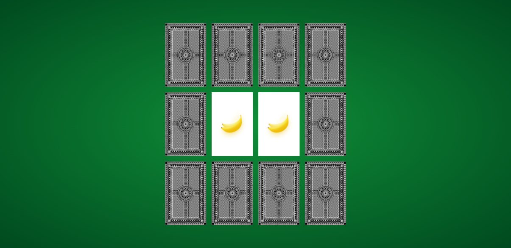
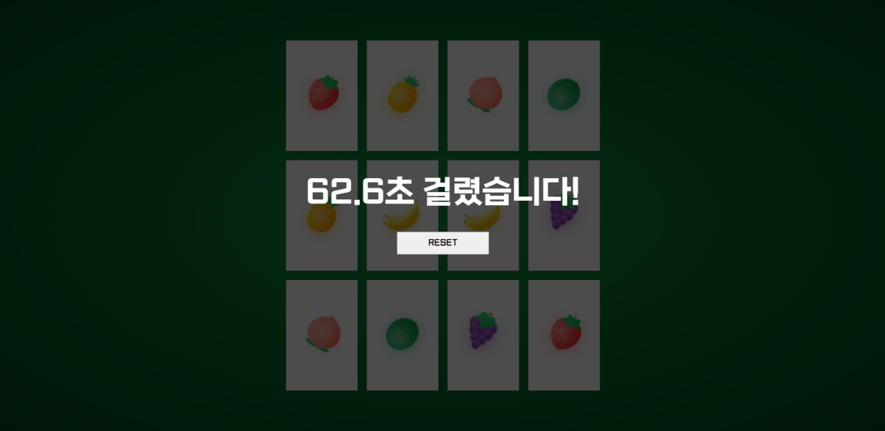

# <center>게임 방법</center>
## <center>카드 짝 맞추기 게임으로 규칙은 간단합니다. 서로 맞는 짝을 찾아 모든 카드를 뒤집으면 게임에서 승리합니다.</center>
<center></center>
<br/>

## <center>게임에서 승리하면 승리하기까지 소비된 시간을 보여줍니다.</center>
<center></center>
<br/>

# <center>기능 구현</center>

```js
const banana = 'url("./images/banana.png")';
const grape = 'url("./images/grape.png")';
const peach = 'url("./images/peach.png")';
const pineapple = 'url("./images/pineapple.png")';
const strawberry = 'url("./images/Strawberry.png")';
const watermelon = 'url("./images/watermelon.png")';

let backgroundImg = [banana, grape, peach, pineapple, strawberry, watermelon];
let backgroundImgClone = backgroundImg.concat(backgroundImg).sort();

// 카드 섞기
cards.forEach(elm => {
  let random = Math.floor(Math.random() * backgroundImgClone.length);
  let randomImg = backgroundImgClone[random];
  backgroundImgClone.splice(random, 1);
  elm.lastChild.style.backgroundImage = randomImg;
});
```

### 카드에 들어갈 이미지들을 각 const에 저장하고 backgroundImg 배열에 할당 했습니다. 그리고 각 과일의 짝을 생성해야 하므로 backgroundImgClone에 concat을 통해 backgroundImg을 복사하여 backgroundImg배열과 합치고 sort를 통해 정렬 했습니다. // 솔직히 sort안 써도 되는데 뭔가 매우 조금 더 카드들이 잘 섞이는? 느낌이 들었습니다. 
### 카드 섞는 방법은 random에 backgroundImgClone.length보다 작은 수를 랜덤으로 할당하고 backgroundImgClone[random]를 randomImg에 할당한 후 순회하는 elm에 style로 할당 했습니다. 그리고 할당된 해당 아이템을 제거해야 하므로 backgroundImgClone.splice(random, 1);를 추가 했습니다.
<br/>

```js
let numOfCards = 0;

setTimeout(() => {
  const cardAnswerInfo = setInterval(() => {
    if(numOfCards < 12) {
      cards[numOfCards].style.transform = 'rotateY(180deg)';
      numOfCards++;
    } else if(numOfCards === 12) {
      clearInterval(cardAnswerInfo);
      setTimeout(() => {
        cards.forEach(elm => {
          elm.style.transform = '';
        });
        $wrap.addEventListener('click', cardClickEvent);
      }, 1000);
    }
  }, 100); 
}, 500);
```

### 첫 화면에서 카드들이 차례대로 뒤집힐 수 있도록 numOfCards변수의 값을 활용하여 배열 아이템을 순서대로 뒤집을 수 있게 하였고 setInterval을 통해 반복 하였습니다. 모든 카드가 뒤집히면 setInterval을 clear하고 1초 뒤에 모든 카드를 다시 뒤집은 후 이벤트 버블링 효과를 활용하여 이벤트 대상인 .card가 아니라 부모인 #wrap에 클릭 이벤트를 활성화 시켰습니다.
<br/>

```js
// 클릭 이벤트
function cardClickEvent(e) {
  let targetElm;
  // 카드 외에 다른 것이 선택되는 것을 방지하기 위한 조건문
  if(e.target.parentNode !== document.body
    && e.target.parentNode !== $wrap
    && e.target.parentNode.style.transform !== 'rotateY(180deg)') {

    // 시작 시간 체크
    if(!startTime) startTime = new Date();
    targetElm = e.target.parentNode;
    targetElms.push(targetElm);
    targetElm.style.transform = 'rotateY(180deg)';
    flag++;
    // 두장 이상의 카드를 선택하는 것을 방지하기 위한 조건문
    if(flag > 2) {
      targetElm.style.transform = '';
    }

    if(targetElms.length === 2) {
      console.log(targetElms[0].lastChild.style.backgroundImage)
      // 두 카드의 짝이 맞을 경우 score++ (게임의 승리 판별)
      if(targetElms[0].lastChild.style.backgroundImage === targetElms[1].lastChild.style.backgroundImage) {
        score++;
      }
      // 선택한 두 카드의 짝이 맞지 않을 경우 .5초 뒤에 두 카드를 뒤집기 효과
      setTimeout(() => {
        if(targetElms[0].lastChild.style.backgroundImage !== targetElms[1].lastChild.style.backgroundImage) {
          targetElms[0].style.transform = '';
          targetElms[1].style.transform = '';
        }
        // 계속해서 targetElms[0]과 targetElms[1]을 비교해야 하므로 배열 초기화
        targetElms.splice(0);
        flag = 0;
      }, 500);
    }
  }
  if(score === 6) {
    // 끝 시간 체크
    if(!endTime) endTime = new Date();
    // 게임에 걸린 시간 체크
    totalTime = ((endTime - startTime) / 1000).toFixed(1);
    $success.classList.add('on');
    $success.innerHTML += `<p>${totalTime}초 걸렸습니다!</p>`;
    $success.innerHTML += '<button id="reset">RESET</button>';
    const $reset = document.querySelector('#reset');
    $reset.addEventListener('click', gameReset);
  }
}
```
<br/>

# <center>후기</center>
## 원래는 zerocho 강의를 보면서 만드려고 했는데 어쩌다 보니 처음부터 끝까지 혼자 만들게 되었습니다. 코드가 깨끗한 코드인지 구별하는 능력은 없지만 매우 높은 확률로 깨끗하지 못한 코드라고 추정은 하고 있습니다만.. 아직은 자바스크립트로 무언가를 구현할 수 있는 능력을 기르는 것에 초점을 두고 있으니 양해 부탁 드립니다. 
<br/>

# <center>진짜 후기</center>
## 그것보다 정리 하는게 은근 시간을 많이 잡아 먹는다. 원래는 zerocho 강의에 있는 토이 프로젝트를 다 만들고 나면 한꺼번에 정리 하려고 했는데 나의 판단미스였다. 이제라도 만들면 바로 바로 정리 해야지,, 정리 해야 되는게 5개나 있는데 언제하지,,ㅋㅋ 솔직히 다른건 나름? 금방 할거 같은데 NumberBaseball은 정리하려니까 좀(매우) 막막하다 