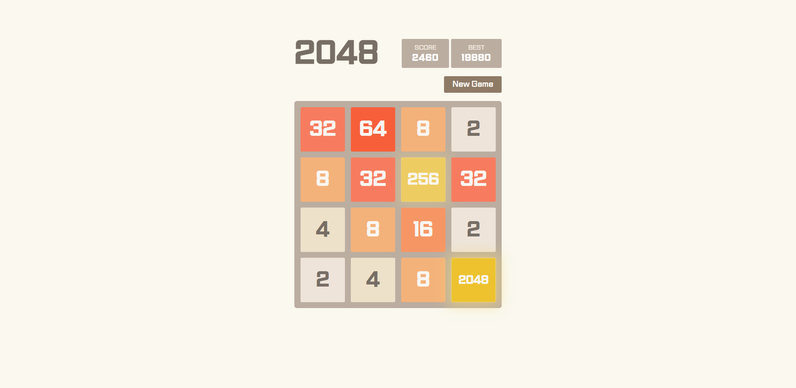
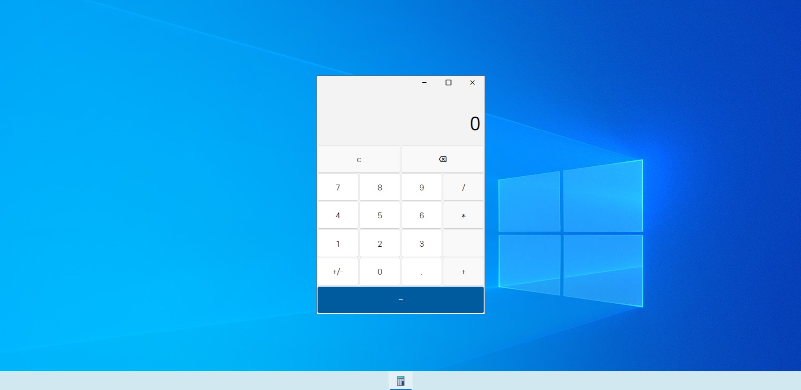
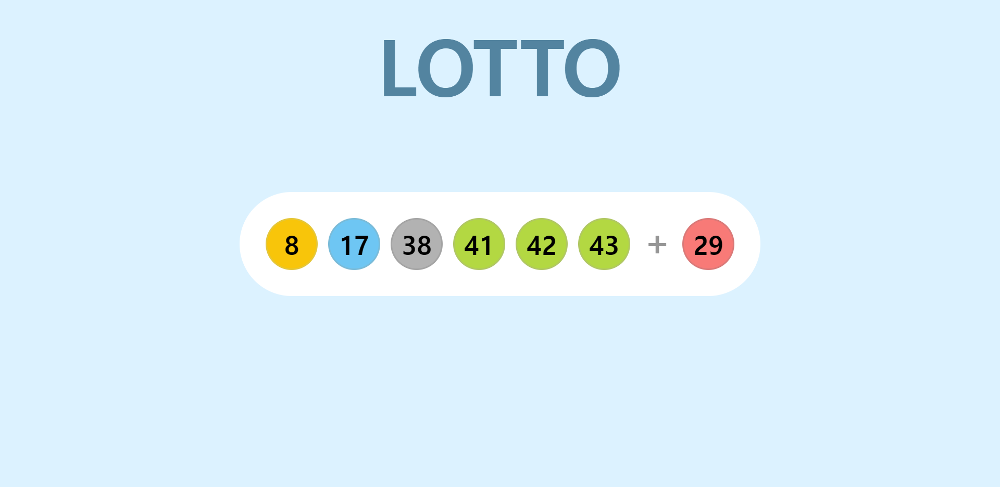
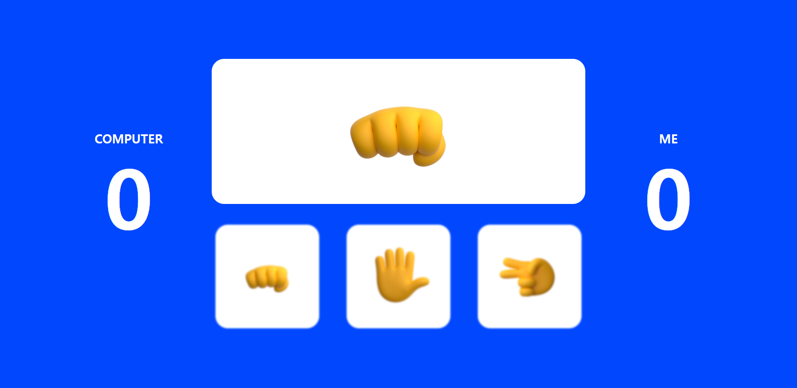
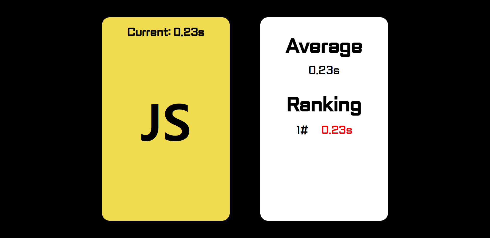
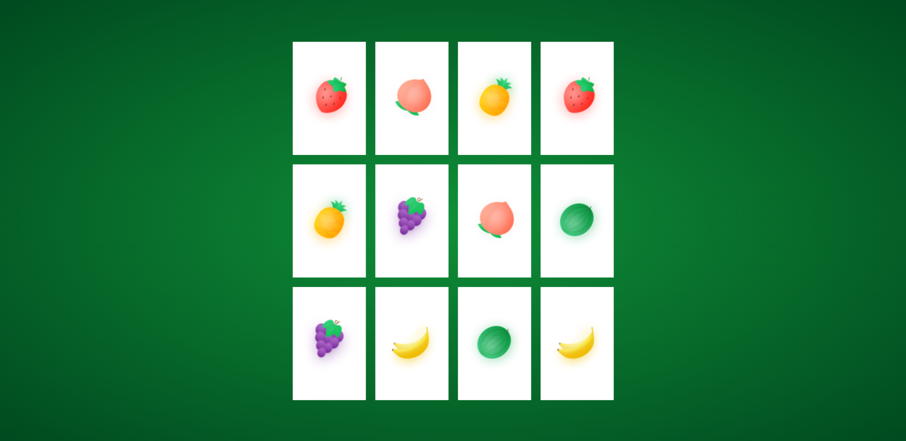
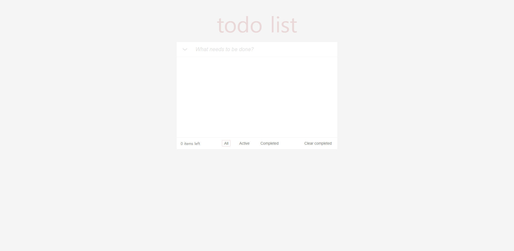
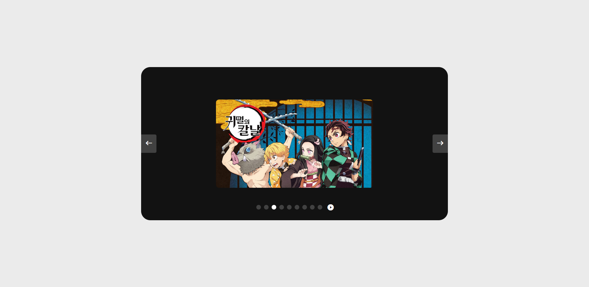

### 
<중요!> 반응형은 지원하지 않습니다. 1920 화면에서 플레이하는 것을 권장 드립니다.

### 이미지를 클릭하면 해당 저장소로 이동 합니다.
 

---
[2048](#2048) 
[계산기](#계산기) 
[숫자야구](#숫자야구) 
[로또 추첨기](#로또-추첨기) 
[가위 바위 보](#가위-바위-보) 
[반응속도 체크](#반응속도-체크) 
[카드 짝 맞추기](#카드-짝-맞추기) 
[Todo List](#todo-list) 
[캐러셀](#캐러셀) 

---
 
 
 

# 2048

 

# 계산기

 

# 숫자야구

 

# 로또 추첨기

 

# 가위 바위 보

 

# 반응속도 체크

 

# 카드 짝 맞추기

 

# Todo List

 

# 캐러셀

 